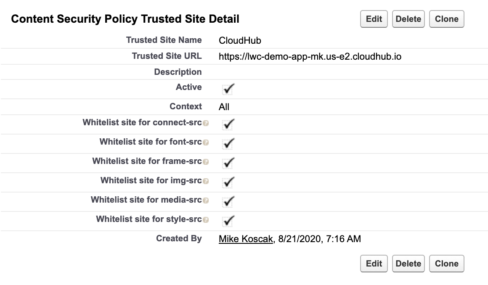
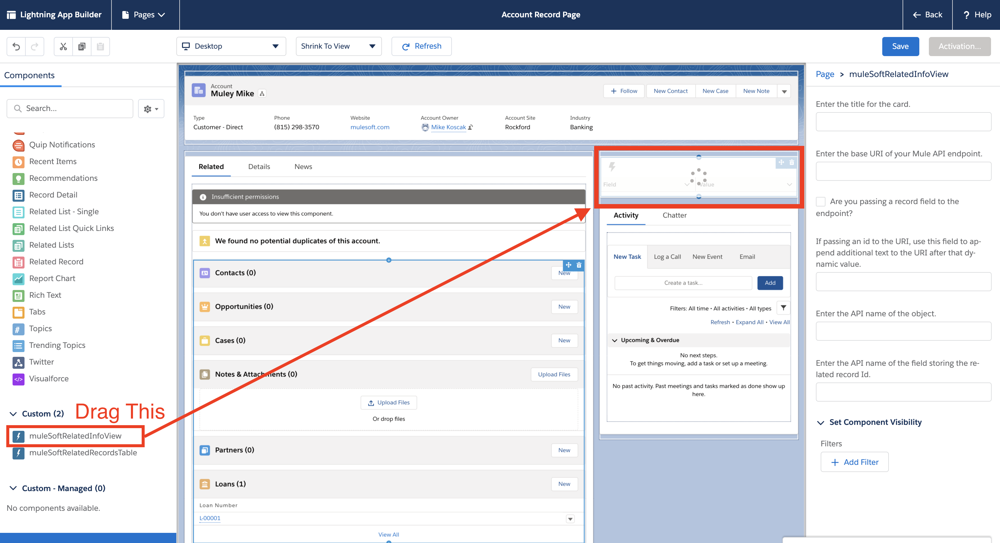
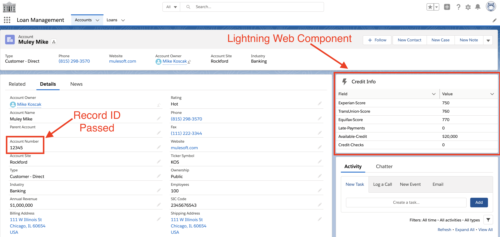
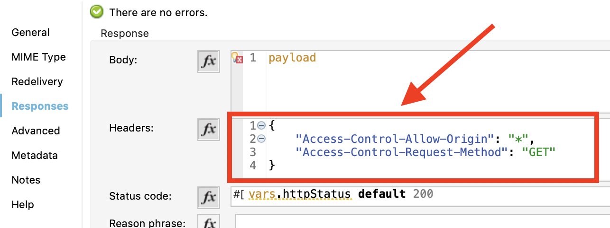

# MuleSoft Lightning Web Components

This repository contains code that can be used to demonstrate how Salesforce Lightning Web Components can be used as a frontend for displaying data from APIs delivered with Mule.  The total setup time from within Salesforce is about 30-60 minutes.  Time spent standing up the Mule app will vary based on use case.  
Currently there are 2 generic components for demonstration: 
**1) Related Info View (Single Record)** 
Use this to display a table of key value pairs.  This is best for displaying a single related record or a list of related information. 
**2) Related Table View (Multi/Child Records)** 
Use this to display a table of related values.  This is best for displaying a list of related records. 
 

## Salesforce LWC Installation & Pre-Configuration
1) Use the Deploy to Salesforce button on this page to install the Lightning Web Components into your Salesforce instance.
2) Ensure my domain is turned on and activated for the org.  Search "My Domain" in Salesforce setup page. https://help.salesforce.com/articleView?id=domain_name_overview.htm&type=5
3) Create CSP Trusted Sites (Note: this step takes 15-45 minutes to kick in after enabled. There is no alert when ready).  In Salesforce Setup, search "CSP Trusted Sites".  Create a new trusted site named LocalHost with Trusted Site URL set to https://localhost:8082 and all other settings left to default.  Create a second CSP trusted site with the URL of your app deployed to CloudHub if you wish to demo with CloudHub (ie https://lwc-demo-app-mk.us-e2.cloudhub.io).

## Configuring the Components
The configuration steps are the same for both components.  Navigate to a page within Salesforce Lightning and use the gear icon at the top right to select edit page.  This will likely be done on a record page (of any object, but should be able to be done from a main/home page as well). 

On the edit page menu, on the left side menu scroll to the bottom to find muleSoftRelatedInfoView and muleSoftRelatedRecordsTable.  Drag one of the components onto the page as shown in the image below. 

Now, click on the component to begin configuring parameters on the right side of the screen.  Set the following attributes with parameters:  
**Enter title for the card** 
Set the card header (ie Credit Info)  
**Enter the base URI of your mule application** 
Set the base endpoint of your mule app (include /api/path.  For my example it is 'https://lwc-demo-app-mk.us-e2.cloudhub.io/api/account/'). Note that the '/' character likely must be used at the end.  
**Are you passing a record field to the endpoint?** 
If you wish to pass one of the fields such as an external id in the URL, mark this as true  
**If passing an id to the URI, set this field to append additional text to the URI after that dynamic value.**  
For my example it is '/credit-check'.  This field is only relevant if you marked the checkbox above true, and can be blank if the last part of the URI is the external id.  Note that the '/' character likely must be used at the start.  
**Enter the API Name of the object** 
Enter the developer API name of the object the page is on (ie Account or Loan__c).  
**Enter the API name of the field storing the related record id.** 
Use this field to denote what you are passing in the URI (ie AccountNumber or CustomField__c). This field will be pulled from the record you have open and injected into the URL for mule. 
  
*A note about the URI: If the Add Record Field flag is left unchecked, the component will callout to only the base endpoint you defined.  If that flag is marked true, the app will callout to a concatenation of Base URI + Dynamic Record Field + Appended Text.  So for the example given here it is calling to https://lwc-demo-app-mk.us-e2.cloudhub.io/api/account/12345/credit-check*

   
## Installation Complete!!
See below for an image of how it looks (image is related info view component)

  
## FAQ
**Is there a difference between Lightning Components and Lightning Web Components?** 
Yes, they are different development frameworks.  Both are similar, but LWC is based more on the Web Components JavaScript framework.  Lightning Components are older and Salesforce is moving towards LWC.  If you are looking at online documentation and blogs and see aura, it is the older Lightning Components.  https://www.salesforceben.com/lightning-web-components-vs-lightning-components-everything-you-need-to-know/  
**Does this have to be an HTTPS endpoint or can I use HTTP?** 
For security Salesforce will block if you do not use HTTPS so *you cannot use HTTP.*  
**The component is not rendering.  How can I debug?** 
Use the browser JavaScript console to view errors.  
**I'm getting an error about CSP or Content Security Policy, where should I look?** 
Check above in the instructions on configuring CSP.  It takes Salesforce 15-45 minutes to pick up changes to this so try waiting.  Note that for localhost you must add the port (ie :8082), and for CloudHub you can ignore the port.  Follow the formatting in the instructions above.  
**I'm getting a CORS error, where do we fix this?** 
You must configure this in the mule app you callout to or Salesforce will block your call.  See the linked sample project to view how this is configured, but you must add the following to your response call headers for your HTTP Listener:

